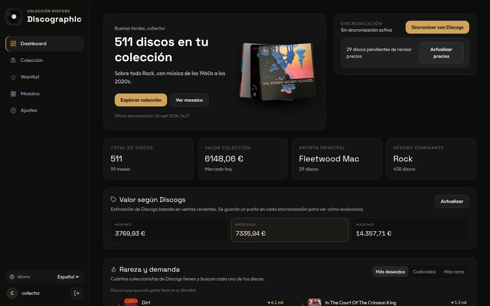
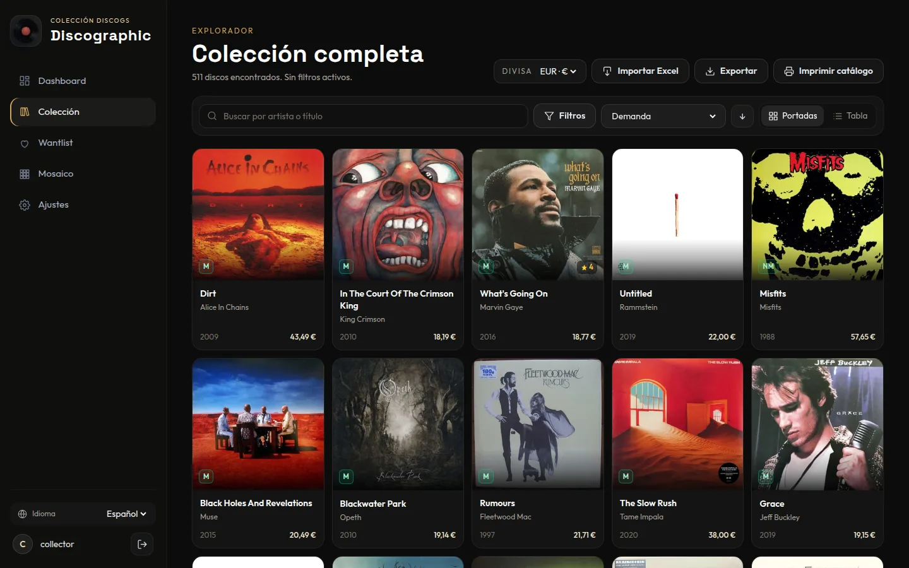
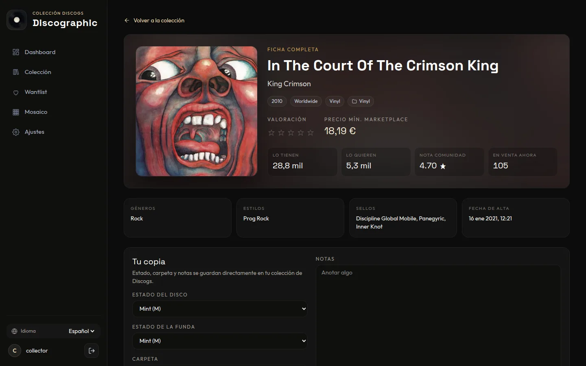
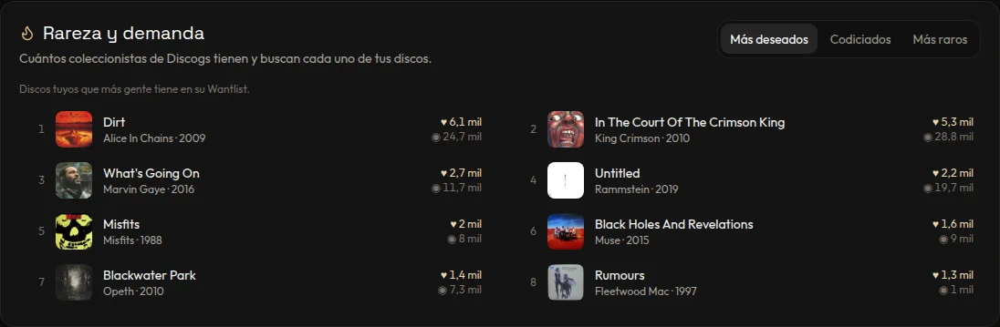
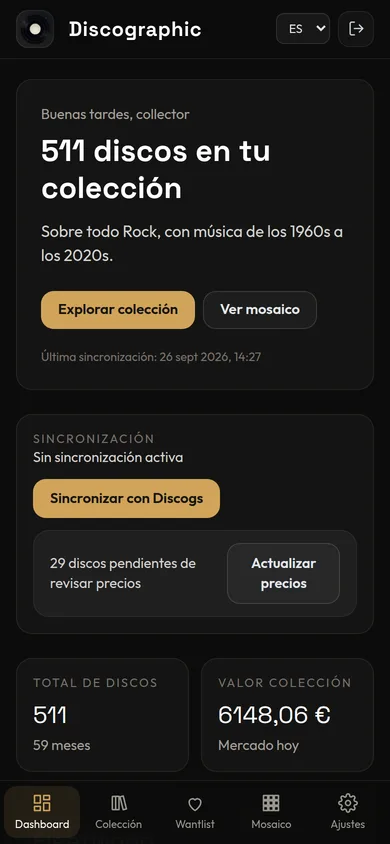

<div align="center">

# Discographic

**Tu colección de Discogs, por fin en casa.**

Una app autohospedada que convierte tu colección de Discogs en algo que da gusto recorrer:
portadas, datos útiles y todos los detalles de cada copia que tienes.

[](https://github.com/SimonBlancoE/discographic/releases)
[](LICENSE)
[](#inicio-rápido)

[Read in English](./README.md)

<br />



</div>

<br />

## Por qué Discographic

- **Ves tu colección, no una hoja de cálculo.** Recórrela por portadas, filtra por lo que quieras y llega al disco que tienes en mente.
- **Sabes lo que tienes.** Cuánto vale, qué discos buscan los coleccionistas y en qué estado está cada copia.
- **Tus datos se quedan contigo.** Funciona en tu ordenador o servidor y guarda una copia local de tu colección. Los cambios se sincronizan con Discogs.

## Lo más destacado

<table>
  <tr>
    <td width="50%" valign="top">
      
      <p><strong>Explora por portadas</strong><br />Alterna entre cuadrícula de portadas y tabla detallada. Filtra por género, estilo, década, formato, sello, carpeta o estado. Se recuerdan la página, el orden y los filtros.</p>
    </td>
    <td width="50%" valign="top">
      
      <p><strong>Cada copia, a fondo</strong><br />Lista de temas, datos de la comunidad, estado del disco y de la funda, carpeta y notas, todo guardado directamente en Discogs. Consulta el resto de ediciones del álbum y cuáles ya tienes.</p>
    </td>
  </tr>
  <tr>
    <td width="50%" valign="top">
      
      <p><strong>Rareza y demanda</strong><br />Descubre tus discos más deseados, más codiciados y más raros, según cuántos coleccionistas de Discogs los tienen y los buscan.</p>
    </td>
    <td width="50%" valign="top" align="center">
      
      <p align="left"><strong>Cómoda también en el móvil</strong><br />El diseño se adapta de monitores anchos a teléfonos, en español e inglés.</p>
    </td>
  </tr>
</table>

### Y además

| | |
|---|---|
| 💰 **Valor de la colección** | La estimación de Discogs (mínimo / mediana / máximo) con su evolución, más el precio de mercado de cada disco. |
| 🏷️ **Precios sugeridos** | Lo que Discogs sugiere pedir según el estado, con el de tu copia resaltado (requiere ajustes de vendedor en Discogs). |
| 📊 **Estadísticas** | Géneros, estilos, décadas, formatos, sellos, crecimiento en el tiempo y tus artistas principales. |
| 🖼️ **Mosaico de portadas** | Un mosaico con tus portadas, exportable como póster de hasta 7200 px. |
| 🖨️ **Catálogo imprimible** | Una lista limpia para imprimir, de toda la colección o de cualquier filtro. |
| 📥 **Importar / exportar** | Excel y CSV. Edita valoraciones y notas en una hoja de cálculo y vuelve a importarlas. |
| 🎯 **Gestor de Wantlist** | Revisa tu Wantlist con precios, prioridades y notas locales. |
| 🎲 **Qué pincho hoy** | Deja que la app elija un disco al azar y desbloquea logros a medida que crece tu colección. |
| 👥 **Multiusuario** | Cada persona conecta su propia cuenta de Discogs y solo ve su colección. |

## Inicio rápido

Necesitas [Docker](https://docs.docker.com/get-docker/).

```bash
git clone https://github.com/SimonBlancoE/discographic.git
cd discographic
docker compose up -d
```

Abre **http://localhost:3800** y:

1. **Crea tu cuenta.** El primer usuario es el administrador.
2. **Conecta Discogs.** En *Ajustes*, escribe tu usuario de Discogs y un token personal ([consíguelo aquí](https://www.discogs.com/settings/developers) → *Generate new token*).
3. **Sincroniza.** Pulsa *Sincronizar con Discogs* en el panel principal. Las colecciones grandes tardan unos minutos la primera vez.

### Actualizar

```bash
git pull
docker compose up -d --build
```

Tus datos viven en un volumen de Docker y se conservan entre actualizaciones. Los cambios de base de datos se aplican solos al arrancar. Haz una copia del volumen antes de actualizaciones importantes.

## Configuración

Opcional. Copia `.env.example` a `.env` para cambiar cualquiera de estas variables:

| Variable | Por defecto | Para qué sirve |
|---|---|---|
| `PORT` | `3800` | Puerto de la app. |
| `HOST_IP` | `127.0.0.1` | Interfaz a la que se enlaza Docker. Usa tu IP de red local para abrirla desde otros dispositivos. |
| `COOKIE_SECURE` | `false` | Ponlo en `true` si sirves la app por HTTPS. |
| `TRUST_PROXY` | `1` si `COOKIE_SECURE=true` | Saltos de proxy de confianza, por ejemplo detrás de Cloudflare Tunnel o de un proxy inverso. |
| `SESSION_SECRET` | *(generado)* | Secreto para firmar las cookies. Si está vacío, se crea uno aleatorio y se guarda en el volumen de datos. |

Las credenciales de Discogs nunca se configuran aquí: cada usuario añade las suyas dentro de la app.

## Preguntas frecuentes

**¿Está seguro mi token de Discogs?** Se guarda en tu servidor y solo el servidor lo usa para hablar con Discogs. El navegador solo ve una vista previa abreviada.

**¿Por qué tarda la primera sincronización?** Discogs limita las apps a 60 peticiones por minuto. La primera sincronización, la revisión de precios y la descarga de datos de comunidad respetan ese límite. Después todo es local y rápido.

**¿Puedo usarla sin Docker?** Sí. Mira *Desarrollo* más abajo. Necesitas Node.js 24 y pnpm.

## Desarrollo

```bash
pnpm install
pnpm run dev:server   # API en http://localhost:3800
pnpm run dev          # app en http://localhost:5173
```

Hecha con React 19, React Router 7, Tailwind CSS 4, Vite 8, Express 5, SQLite (better-sqlite3), Recharts y Sharp, todo en TypeScript.
Antes de abrir un pull request, lee [CONTRIBUTING.md](./CONTRIBUTING.md) para ver las normas del proyecto y los comandos de verificación.

## Licencia

[MIT](LICENSE)
