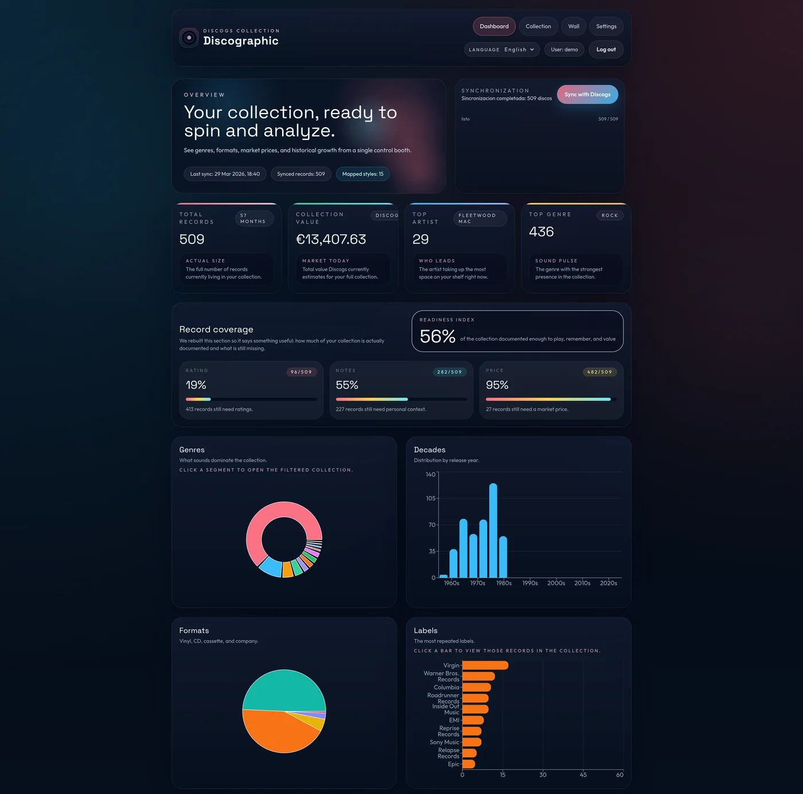
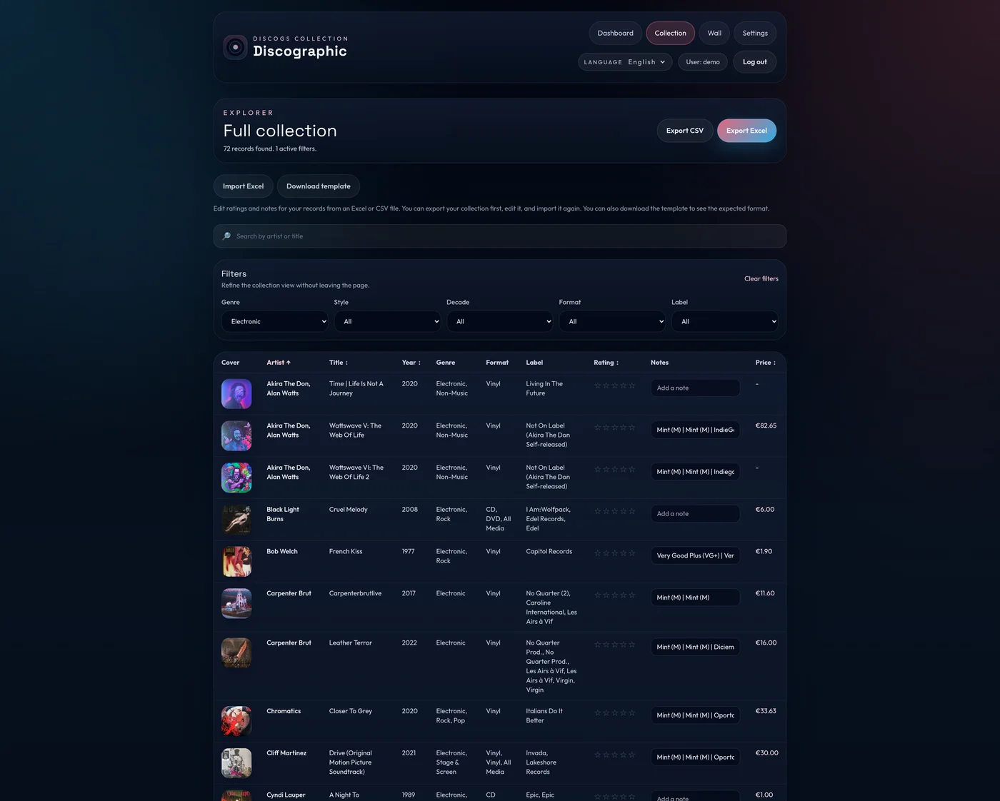
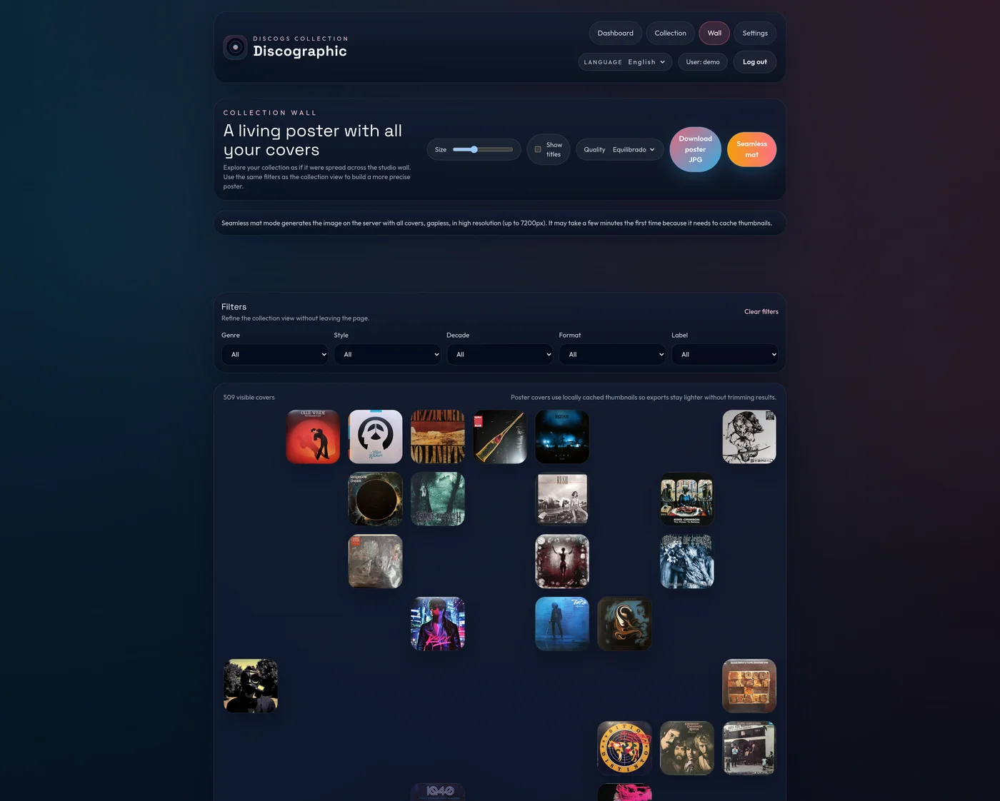

<div align="center">

# Discographic

**Tu centro de mando autohospedado para tu colección de vinilos.**

Sincroniza tus discos de Discogs, explora estadísticas, puntúa y anota todo, y exporta pósteres u hojas de cálculo desde una sola app que puedes ejecutar en tu ordenador o servidor.

**Idioma principal:** Español  
**English version:** [Read in English](./README.en.md)

> `README.md` es la versión canónica. Cualquier cambio de contenido debe reflejarse también en `README.en.md` dentro del mismo PR.

[](LICENSE)
[](https://docs.docker.com/get-docker/)
[](https://nodejs.org/)
[](https://www.sqlite.org/)

<br />
<br />



<br />
<br />

*Pensado para coleccionistas que quieren un panel rápido y personal para su discoteca, sin entregar sus datos a otro servicio más.*

</div>

## ¿Qué es?

Discographic es una aplicación web autohospedada para explorar y gestionar tu colección de Discogs de una forma realmente útil en el día a día.

En lugar de limitarse a mostrar una lista cruda de lanzamientos, ofrece un panel real, un navegador de colección con búsqueda, un muro visual de portadas, exportaciones, notas, valoraciones y una caché local para que la app siga siendo rápida una vez sincronizada tu biblioteca. Funciona muy bien para una sola persona, pero también tiene sentido para un pequeño grupo de amigos compartiendo la misma instancia.

## ¿Por qué usarlo?

- **Tus datos se quedan contigo** — todo se cachea localmente en SQLite.
- **Fácil de ejecutar** — con Docker Compose estás dentro.
- **Pensado para coleccionistas, no solo CRUD** — gráficas, seguimiento de valor, filtros, notas, exportaciones y generación de pósteres.
- **Interfaz en español e inglés** — la aplicación es bilingüe.
- **Listo para varios usuarios** — cada usuario conecta su propia cuenta de Discogs y solo ve su propia colección.

## Vista rápida

<table>
  <tr>
    <td width="50%" valign="top">
      
      <p><strong>Navegador de colección</strong><br />Busca, filtra, ordena, puntúa, anota y exporta tus discos.</p>
    </td>
    <td width="50%" valign="top">
      
      <p><strong>Muro de portadas</strong><br />Convierte tu colección en un muro visual o en un póster de alta resolución.</p>
    </td>
  </tr>
</table>

## Qué incluye

- **Panel principal** — totales de la colección, valor estimado, gráficas y vistas tipo leaderboard.
- **Navegador de colección** — búsqueda, filtros, ordenación, puntuaciones en línea y notas.
- **Páginas de detalle** — tracklist, metadatos y exportación en PNG.
- **Muro de portadas** — generación fluida de pósteres hasta 7200px.
- **Importación / Exportación** — compatibilidad con Excel y CSV.
- **Logros** — desbloqueables por niveles e insignias ocultas.
- **Selector aleatorio** — para cuando quieres que la app elija el disco de esta noche.

## Inicio rápido

Si solo quieres ponerla en marcha, este es el camino.

### 1. Arranca con Docker

Necesitas tener [Docker](https://docs.docker.com/get-docker/) instalado.

```bash
git clone https://github.com/SimonBlancoE/discographic.git
cd discographic
docker compose up -d
```

Después abre **http://localhost:3800** en tu navegador.

### 2. Crea tu primer usuario

En el primer arranque, Discographic te pedirá crear una cuenta de administrador.

### 3. Conecta tu cuenta de Discogs

Después de iniciar sesión:

1. Abre **Settings**
2. Introduce tu usuario de Discogs
3. Pega tu token personal de acceso
4. Ejecuta **Sync with Discogs**

### 4. Consigue tu token de Discogs

1. Ve a [discogs.com/settings/developers](https://www.discogs.com/settings/developers)
2. Haz clic en **Generate new token**
3. Cópialo dentro de Discographic

Eso es todo lo que la aplicación necesita para leer tu colección y sincronizar datos como puntuaciones y notas de vuelta a Discogs.

### Cómo detenerla o reiniciarla después

```bash
docker compose down
docker compose up -d
```

Tus datos se conservan en el volumen de Docker.

## Desarrollo local

Si quieres trabajar en el código en vez de solo ejecutar la aplicación:

```bash
npm install
```

Necesitas dos terminales:

```bash
# Terminal 1 — servidor API
npm run server

# Terminal 2 — servidor Vite con hot reload
npm run dev
```

- Frontend: http://localhost:5173
- Backend: http://localhost:3800

### Variables de entorno

Copia `.env.example` a `.env` si quieres sobrescribir los valores por defecto:

```env
HOST_IP=127.0.0.1                         # IP de bind de Docker (usa tu IP LAN para exponerlo)
PORT=3800                                 # Puerto de la API
SESSION_SECRET=change-this-in-production  # Secreto para firmar cookies
COOKIE_SECURE=false                       # Ponlo en true detrás de HTTPS
```

Las credenciales de Discogs **no** se configuran con variables de entorno. Cada usuario las añade dentro de la propia app.

## Stack técnico

| Capa | Tecnología |
|---|---|
| Frontend | React 18, Vite, Tailwind CSS |
| Backend | Node.js, Express |
| Base de datos | SQLite vía better-sqlite3 |
| Gráficas | Recharts |
| Procesado de imágenes | Sharp |
| Empaquetado | Docker multi-stage build |

## Estructura del proyecto

```text
src/          Frontend React (pages, components, hooks, context)
server/       API Express, SQLite, cliente de Discogs y rutas
shared/       Utilidades y textos i18n compartidos entre frontend y backend
public/       Recursos estáticos
data/         Datos en ejecución — base SQLite y portadas cacheadas (gitignored)
docs/         Capturas usadas en el README
```

## Solución de problemas

**`better-sqlite3` o `sharp` fallan al instalar**

Ambos paquetes usan binarios nativos. En Linux puede que necesites `build-essential` y `python3`. En macOS, instala las Xcode command line tools. La imagen Docker evita este problema por completo.

**El puerto 3800 ya está en uso**

Cambia el puerto en `.env` o en `docker-compose.yml`.

**La primera sincronización tarda bastante**

Es normal en colecciones grandes. Discogs aplica rate limiting a la API, así que la sincronización inicial puede tardar varios minutos. Las siguientes sincronizaciones son mucho más rápidas.

**Las portadas van lentas la primera vez**

Las miniaturas se cachean localmente. La primera generación del muro o del póster es la lenta; después mejora mucho.

## Licencia

[MIT](LICENSE)
