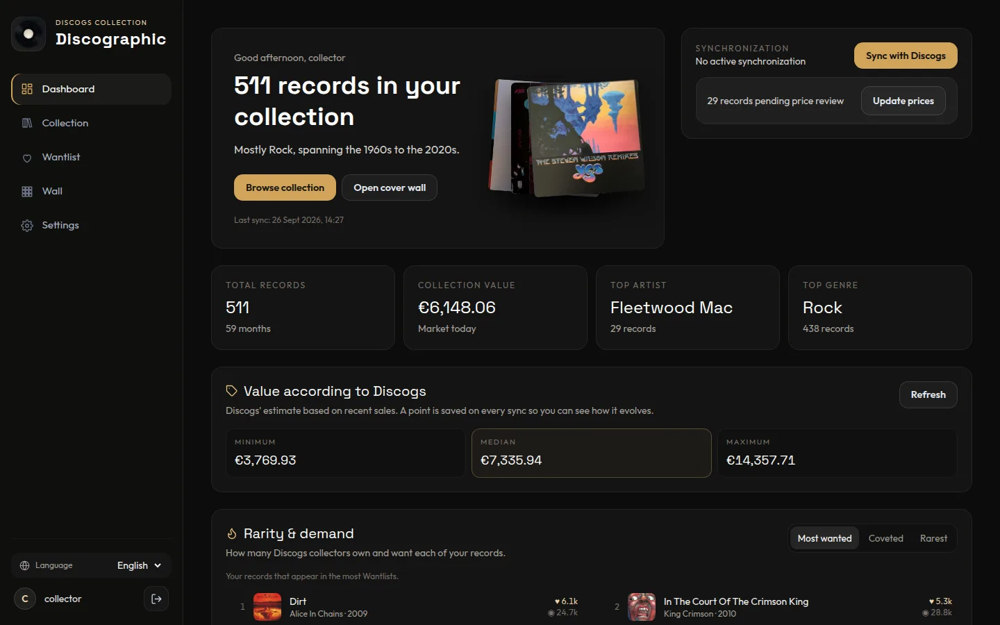
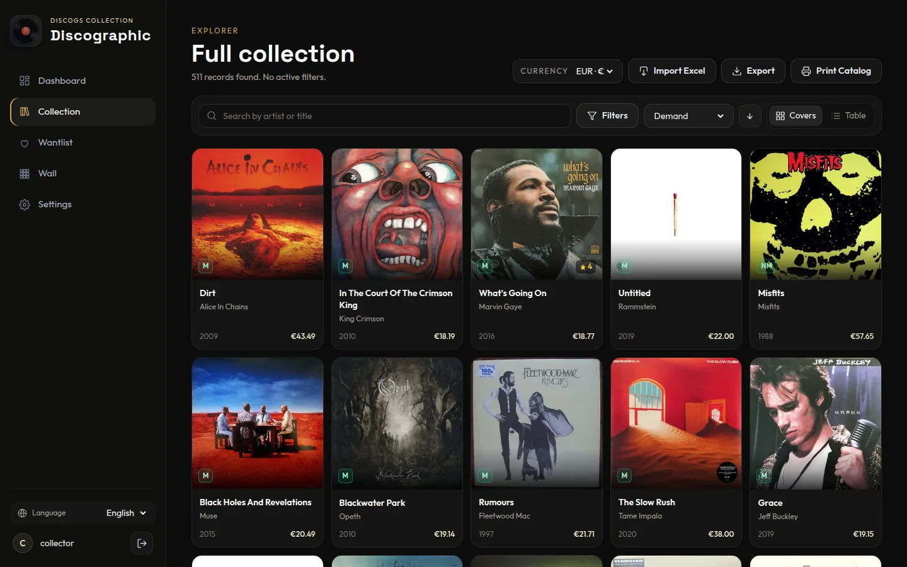
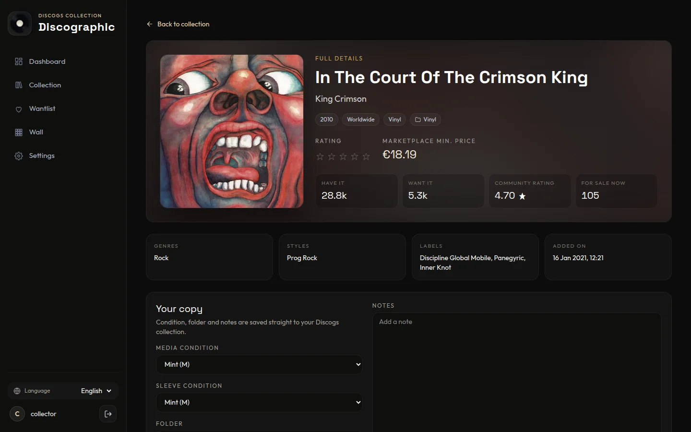
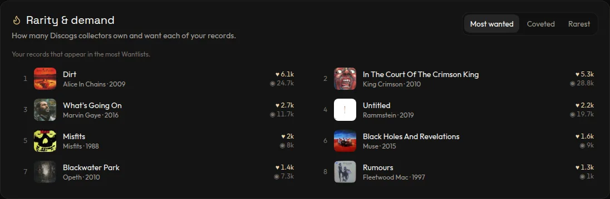
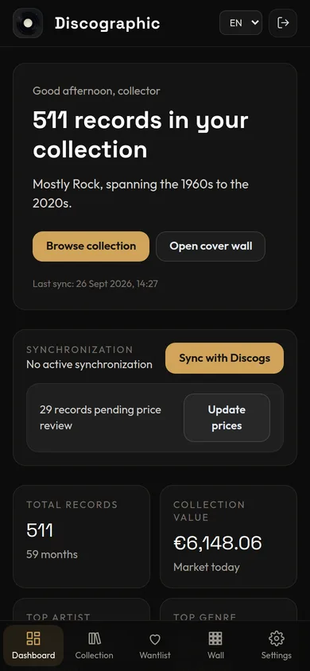

<div align="center">

# Discographic

**Your Discogs collection, finally at home.**

A self-hosted app that turns your Discogs collection into something you actually enjoy browsing:
beautiful covers, real insights, and every detail of every copy you own.

[](https://github.com/SimonBlancoE/discographic/releases)
[](LICENSE)
[](#quick-start)

[Leer en español](./README.es.md)

<br />



</div>

<br />

## Why Discographic

- **See your collection, not a spreadsheet.** Browse by cover, filter by anything, and jump straight to the record you're thinking of.
- **Know what you have.** How much it's worth, which records collectors are hunting for, and the condition of every copy.
- **Your data stays with you.** It runs on your own computer or server and keeps a local copy of your collection. Edits sync back to Discogs.

## Highlights

<table>
  <tr>
    <td width="50%" valign="top">
      
      <p><strong>Browse by cover</strong><br />Switch between a cover grid and a detailed table. Filter by genre, style, decade, format, label, folder or condition. Your page, sort and filters are remembered.</p>
    </td>
    <td width="50%" valign="top">
      
      <p><strong>Every copy, in depth</strong><br />Tracklist, community stats, media and sleeve condition, folder and notes, all saved straight to Discogs. See every other pressing of the album and which ones you already own.</p>
    </td>
  </tr>
  <tr>
    <td width="50%" valign="top">
      
      <p><strong>Rarity &amp; demand</strong><br />Discover your most wanted, most coveted and rarest records, based on how many Discogs collectors own and want them.</p>
    </td>
    <td width="50%" valign="top" align="center">
      
      <p align="left"><strong>At home on your phone</strong><br />A layout that adapts from wide monitors to phones, in English and Spanish.</p>
    </td>
  </tr>
</table>

### Everything else

| | |
|---|---|
| 💰 **Collection value** | Discogs' own estimate (min / median / max), tracked over time, plus marketplace prices per record. |
| 🏷️ **Suggested prices** | What Discogs suggests asking for each condition, with your copy's grade highlighted (needs Discogs seller settings). |
| 📊 **Stats** | Genres, styles, decades, formats, labels, growth over time and your top artists. |
| 🖼️ **Cover wall** | A mosaic of your covers, exportable as a poster up to 7200 px. |
| 🖨️ **Print catalog** | A clean, printable list of your whole collection or any filtered part of it. |
| 📥 **Import / export** | Excel and CSV. Edit ratings and notes in a spreadsheet and import them back. |
| 🎯 **Wantlist manager** | Review your Wantlist with prices, priorities and local notes. |
| 🎲 **Pick for tonight** | Let the app choose a random record, and unlock achievements as your collection grows. |
| 👥 **Multi-user** | Each person connects their own Discogs account and sees only their collection. |

## Quick start

You need [Docker](https://docs.docker.com/get-docker/).

```bash
git clone https://github.com/SimonBlancoE/discographic.git
cd discographic
docker compose up -d
```

Open **http://localhost:3800**, then:

1. **Create your account.** The first user becomes the admin.
2. **Connect Discogs.** In *Settings*, enter your Discogs username and a personal token ([get one here](https://www.discogs.com/settings/developers) → *Generate new token*).
3. **Sync.** Press *Sync with Discogs* on the dashboard. Large collections take a few minutes the first time.

### Updating

```bash
git pull
docker compose up -d --build
```

Your data lives in a Docker volume and is kept across updates. Database changes are applied automatically on startup. Back up the volume before major upgrades.

## Configuration

Optional. Copy `.env.example` to `.env` to change any of these:

| Variable | Default | What it does |
|---|---|---|
| `PORT` | `3800` | Port the app listens on. |
| `HOST_IP` | `127.0.0.1` | Interface Docker binds to. Use your LAN IP to reach it from other devices. |
| `COOKIE_SECURE` | `false` | Set to `true` when serving over HTTPS. |
| `TRUST_PROXY` | `1` when `COOKIE_SECURE=true` | Proxy hops to trust, e.g. behind Cloudflare Tunnel or a reverse proxy. |
| `SESSION_SECRET` | *(generated)* | Cookie signing secret. If empty, a random one is created and kept in the data volume. |

Discogs credentials are never set here: each user adds their own inside the app.

## FAQ

**Is my Discogs token safe?** It's stored on your server and only used by the server to talk to Discogs. The browser only ever sees a short preview of it.

**Why is the first sync slow?** Discogs limits apps to 60 requests per minute. The first sync, price review and community data download respect that limit. After that, everything is local and fast.

**Can I run it without Docker?** Yes. See *Development* below. You'll need Node.js 24 and pnpm.

## Development

```bash
pnpm install
pnpm run dev:server   # API on http://localhost:3800
pnpm run dev          # app on http://localhost:5173
```

Built with React 19, React Router 7, Tailwind CSS 4, Vite 8, Express 5, SQLite (better-sqlite3), Recharts and Sharp, all in TypeScript.
Before opening a pull request, read [CONTRIBUTING.md](./CONTRIBUTING.md) for the project guidelines and the verification commands.

## License

[MIT](LICENSE)
